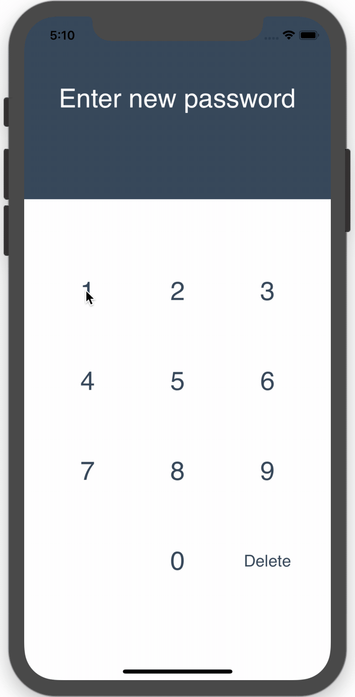

**MBSPasswordView** is a custom view that provides an easy way to use a block-screen password.

## Support
iOS 11.0+

## Features
- [X] Pure Swift 4
- [X] Support 4 digits validation
- [X] Light touch impact
- [X] Shakable view
- [X] Custom animation
- [X] Very ease to use.


## Success Case


## Invalid Case


## Installation

### CocoaPods
```
pod 'MBSPasswordView'
```

### Carthage

MBSPasswordView is available through [Carthage](https://github.com/Carthage/Carthage). To install
it, simply add the following line to your Cartfile:
```
github "mayckonx/MBSPasswordView"
```

## How to Use
1. Import the framework
```
import MBSPasswordView
```

2. Create an outlet and link it to your view as a MBSPasswordView.
```
@IBOutlet weak var passwordView: MBSPasswordView!
```

3. Implement the protocol to get the password result.
```
extension ViewController: MBSPasswordDelegate {
     func password(_ result: [String]) {
        print("Password:\(result)")
    }
}
```

4. Set the delegate in your viewDidLoad
```
  override func viewDidLoad() {
        super.viewDidLoad()
        
        passwordView.delegate = self
    }
```

That's it. It's done brah! 

You can customize the view. In the sample you can see how to access the properties and change it to your preferences. 

## Next improvments
1. Support 6 digits
2. Different kind of animations
3. TouchID and FaceID

## Suggestions or feedback?

Feel free to create a pull request, open an issue or find [me on Twitter](https://twitter.com/mayckonx).
